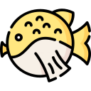

# PROYECTO DE CLASES-ANIMALES
<!-- PROJECT LOGO -->
<br />
<p align="center">
  <a href="https://github.com/emorenocast/clases-animales.git">
    
  </a>

  <h3 align="center">clase-animales</h3>

  <p align="center">
    Proyecto de clase.
    <br />
    <br />
  </p>
</p>

## Ejecutar el proyecto

para ejecutar el proyecto debe descargar el repositorio y pocisionarse desde la terminal en el proyecto luego en la raiz del proyecto nos diriguimos a la carpeta pilares para luego ejecutar el programa.

```
#comando para posicionarse dentro de la carpeta pilares
cd Pilares
``` 
```
#comando para ejecutar el programa
donet run
``` 


## Alumna

soy una crack ([emoji key](https://allcontributors.org/docs/en/emoji-key)):

<!-- prettier-ignore-start -->
<!-- markdownlint-disable -->
<table>
  <tr>
    <td align="center"><a href="https://github.com/emorenocast"><br /><sub><b>Estefania Moreno</b></sub></a><br /><a href="https://github.com/emorenocast" title="Code">💻</a></td>
</table>
